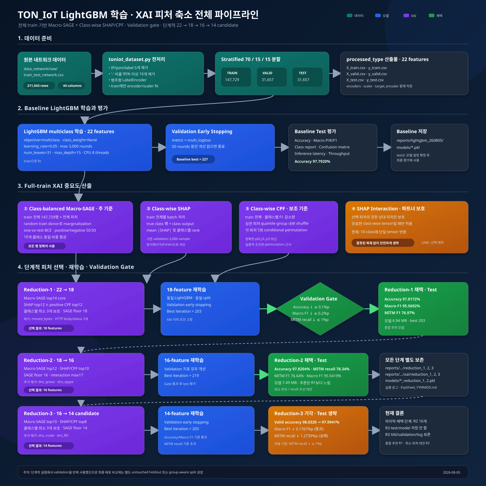

# TON_IoT Pipeline Figures

## Training and feature-extraction pipeline

The diagram covers:

- raw network-data preprocessing and stratified train/validation/test split;
- LightGBM training with validation early stopping;
- full-training-data Macro-SAGE, class-wise SHAP, and class-wise CPF;
- guarded SHAP-interaction handling and optional LIME usage;
- reduction-1 (22 to 18 features), reduction-2 (18 to 16 features), and the rejected reduction-3 candidate (16 to 14 features);
- validation acceptance gates, test evaluation, model selection, and artifacts.

The SVG is the editable source and can be opened directly in a browser or VS Code.

- Editable source: `toniot_training_feature_extraction_pipeline.svg`
- Rendered preview: `toniot_training_feature_extraction_pipeline.png`

Reduction-3 selected 14 features but was rejected because validation MITM recall dropped by 1.2739 percentage points, above the 1.0-point limit. Its test set was not evaluated.
